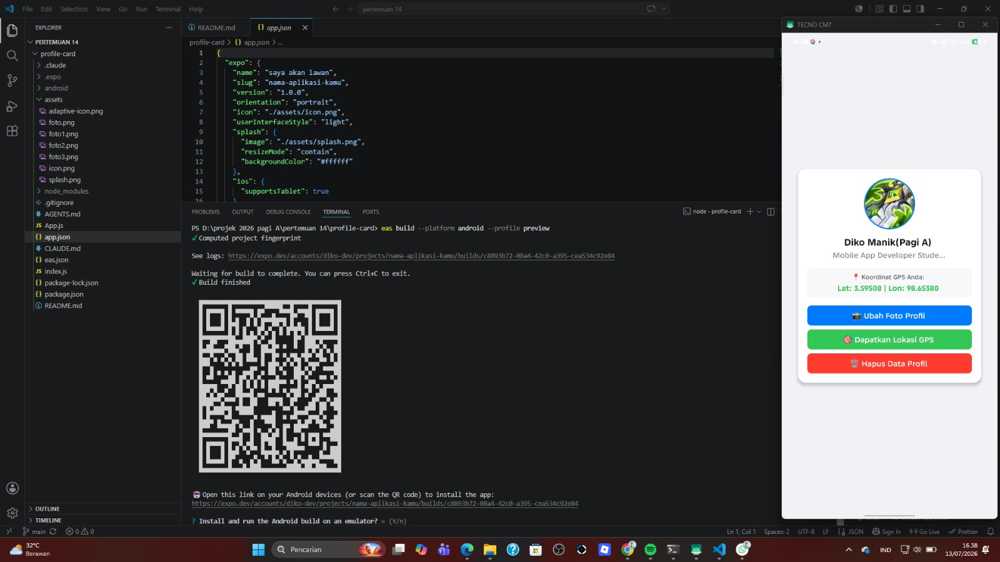
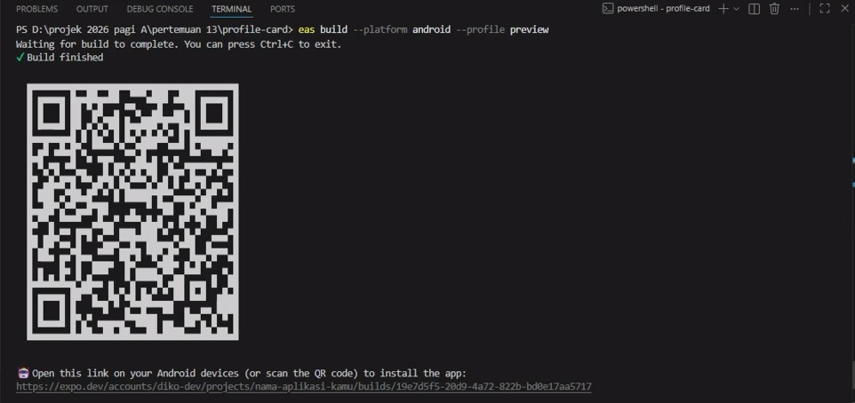
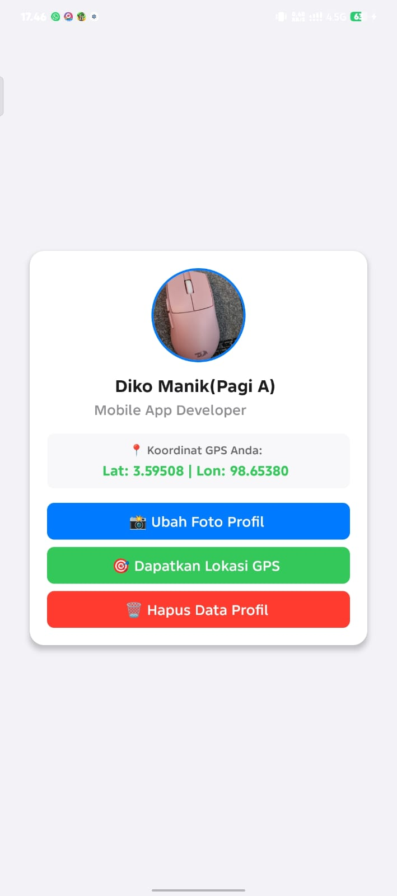

# 📱 Profile Card App


Aplikasi mobile sederhana berbasis **React Native** dan **Expo** yang menampilkan kartu profil pengguna dengan fitur penggantian foto profil, pengambilan lokasi GPS, serta penghapusan data profil.

---

# 📷 Screenshot L1

## Scrcpy


## USB

[USB](assets/usb_debugging.png)

## DEVICES

[DEVICES](assets/adb_devices.png)

# 📷 Screenshot L2

## Home Screen



## GPS Location



## Delete Profile


---

# ✨ Features

- Menampilkan informasi profil pengguna.
- Mengubah foto profil.
- Mengambil lokasi GPS secara realtime.
- Menampilkan koordinat Latitude dan Longitude.
- Menghapus data profil.
- Antarmuka sederhana dan responsif.

---

# 🛠 Tech Stack

| Technology | Function |
|------------|----------|
| React Native | Mobile Application Development |
| Expo | React Native Framework |
| JavaScript | Programming Language |
| Expo Location | Mengambil lokasi GPS |
| Expo Image Picker | Mengubah foto profil |
| Git & GitHub | Version Control |

---

# 🚀 Installation

Clone repository

```bash
git clone https://github.com/gansdiko069-droid/pertemuan15
```

Masuk ke folder project

```bash
cd profile-card
```

Install dependency

```bash
npm install
```

Menjalankan project

```bash
npx expo start
```

---

# 📥 Download APK

APK dapat diunduh melalui link berikut:

https://expo.dev/accounts/diko-dev/projects/nama-aplikasi-kamu/builds/f2f3dec0-7c77-45d6-befe-aef7b54c27b9

---

# 📂 Project Structure

```
profile-card/
│
├── assets/
├── App.js
├── app.json
├── package.json
├── README.md
└── eas.json
```
link expo snack : https://snack.expo.dev/@diko-dev/calm-violet-almond

## 📄 License

This project is created for educational purposes as part of the React Native Mobile Programming course.

# 👨‍💻 Developer

**Nama :** Lolo Diko Manik

**NIM :** 243303621222

**Program Studi :** Sistem Informasi

**Universitas :** Universitas Prima Indonesia

---

# ⭐ Repository

Jika project ini bermanfaat silakan beri ⭐ pada repository GitHub.

## 🙏 Acknowledgements

- React Native
- Expo
- GitHub
- Universitas Prima Indonesia
